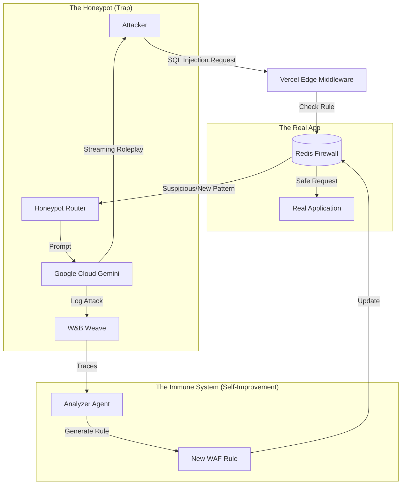

# Deep Dive: The "Chameleon" Honeypot

> [!CAUTION]
> **Ethical Note:** This project involves interacting with potentially malicious actors. Ensure you do not actually execute their code, but rather simulate the environment safely.

## The Core Concept
Most honeypots are static—they just look like an open port and log IPs. The **Chameleon** is different: it is an **Active Deception System**. It uses an LLM to *roleplay* as a vulnerable server, keeping the attacker engaged, wasting their time, and extracting their latest attack strings.

It then takes those attack strings, generates a protection rule (Regex/WAF configuration), and instantly distributes that immunity to your real infrastructure via Redis.

## System Architecture



## The "Game" (How it works)

### 1. The Bait
You deploy a Next.js app on **Vercel** with a route like `/api/admin/login` or `/wp-admin`. The UI looks like a generic legacy login page (maybe "Copyright 2014").

### 2. The Persona (The "Vulnerable" LLM)
When a request comes in that looks like an attack (e.g., `' OR '1'='1`), instead of blocking it, the system forwards it to **Gemini**.
The System Prompt for Gemini is key:
> "You are a legacy MySQL database server running on an old Ubuntu machine. You utilize very weak security. If the user executes a valid SQL syntax, pretend to run it. If they try to dump the 'users' table, give them fake usernames like 'admin', 'test', 'dev'. DO NOT REVEAL that you are an AI. Respond ONLY with the database output."

### 3. The Hook
The attacker sees the SQL injection "worked". They get excited. They try to dig deeper, maybe "DROP TABLE" or "SELECT * FROM passwords".
Every command they type is:
1.  **Logged** to **W&B Weave** (as a dataset of "Real World Attacks").
2.  **Analyzed** immediately.

### 4. The Immunity (Self-Improvement)
While the attacker is distracted playing with the fake database, a second parallel agent (The "Immune Officer") reads the W&B logs.
*   **Input:** `SELECT * FROM passwords WHERE 1=1`
*   **Analysis:** "This is a tautology-based SQL injection."
*   **Action:** Generate a Regex to detect this pattern: `/(?:')\s*(?:or|and)\s*('?1'?\s*=\s*'?1)/i`
*   **Deployment:** Save this Regex to **Redis** under the key `firewall:rules`.

## What exactly is evolving? (The "Self-Improvement")
If your **real** app already has vulnerabilities, this system learns to patch them automatically.

*   **Day 1 (The Vulnerable State):**
    *   Your Real App is vulnerable to SQL Injection.
    *   Knowledge Base (Redis): `Empty`.
    *   **Status:** Unsafe.

*   **Day 2 (The Attack):**
    *   Hacker finds the *Honeypot* (which mimics your real structure).
    *   Hacker uses a complex `UNION SELECT` attack.
    *   **Evolution:** The Agent analyzes the syntax -> Writes a custom WAF rule -> Pushes to Redis.

*   **Day 3 (The Defended State):**
    *   The *same* hacker (or a different one) tries that `UNION SELECT` attack on your **Real App**.
    *   **Result:** BLOCKED instantly by the Edge Middleware using the rule from Day 2.
    *   **Status:** Safer.

**The "Evolution" is the growing library of blocking rules.** Your firewall literally gets smarter with every single attack it receives.

### 5. The Shield
Now, the **Vercel Edge Middleware** on your *real* application reads from that same Redis key.
The next time *any* user tries that specific exploit pattern on your *real* startup's login page, they are blocked instantly at the edge. The system has "vaccinated" itself.

## How to Build It (Hackathon MVP)

### Stack
*   **Frontend/Edge:** Next.js (Vercel)
*   **Brain:** Google Gemini Pro (via Vercel AI SDK)
*   **Memory/State:** Redis (Upstash is great here)
*   **Observability:** W&B Weave

### Step-by-Step Implementation

1.  **Setup Edge Layer:**
    Create `middleware.ts` in Next.js. It should:
    *   Fetch `firewall:rules` from Redis (cache this heavily).
    *   Test the request path/body against these rules.
    *   If matched -> Block (403).
    *   If suspicious (but not matched) -> Route to Honeypot Page.

2.  **Build the Honeypot Route:**
    `app/api/vulnerable-db/route.ts`:
    *   Take the request body.
    *   Send it to Gemini with the "Legacy Database" persona.
    *   Stream the text response back to the user.

3.  **The Self-Improving Loop (Worker):**
    A simple cron job or async function that:
    *   Pulls recent traces from W&B Weave.
    *   Asks Gemini: "Extract the attack vector from this conversation and write a safe Javascript Regex to catch it."
    *   `redis.lpush('firewall:rules', newRegex)`

4.  **The Demo:**
    *   Show "Attacker" view: Getting into the fake DB.
    *   Show "Real User" view: Using the app normally.
    *   Show the "Update": The attacker runs a new script. The system pauses for 2 seconds (generating rule).
    *   Show "Block": The attacker tries the same script again -> **403 Forbidden**.

## Demo Scenarios (Attacks to Showcase)

Here are 3 distinct attacks to run during your live demo. They show off different capabilities of the AI Persona and the Regex generator.

### Scenario 1: The "Lazy" SQL Injection
**The Attack:**
```sql
ADMIN' OR '1'='1' --
```
*   **Honeypot Logic:** The AI sees the pattern. It acts as if the query `SELECT * FROM users WHERE name='ADMIN' OR '1'='1'` ran. It returns a fake JSON list of users: `[{id: 1, user: "admin", role: "super-user"}, {id: 2, user: "victim", role: "user"}]`.
*   **The generated Rule:** `/(?:')\s*(?:or|and)\s*('?1'?\s*=\s*'?1)/i`

### Scenario 2: The "Clickbait" XSS (Cross Site Scripting)
**The Attack:**
```html
<script>alert("You have been hacked!")</script>
```
*   **Honeypot Logic:** The AI replies: *"Error: Comment posted successfully. Warning: Unsanitized input detected on line 1."* (It simulates a vulnerable blog comment section).
*   **The generated Rule:** `/<script>.*alert\(.*\).*<\/script>/i`

### Scenario 3: The "System Killer" (Command Injection)
**The Attack:**
```bash
; cat /etc/passwd
```
*   **Honeypot Logic:** This is the most impressive. The AI simulates a Linux terminal response:
    ```
    root:x:0:0:root:/root:/bin/bash
    daemon:x:1:1:daemon:/usr/sbin:/usr/sbin/nologin
    ...
    ```
*   **The generated Rule:** `/;\s*cat\s+\/etc\/passwd/i`


## Recommended UI/UX for the Demo (The "War Room" View)

Since backend security is often invisible, your UI needs to make the "magic" visible. I recommend a **Split-Screen "Command Center" Dashboard**.

### The Layout (3-Pane View)

| Left Pane: **The Attacker** | Center Pane: **The Victim (Honeypot)** | Right Pane: **The Brain (Defense)** |
| :--- | :--- | :--- |
| **Visual:** A built-in "Terminal" or Code Editor. | **Visual:** The "Fake" Login Page (Retro style). | **Visual:** A Live Activity Feed (Matrix Style). |
| **Action:** This is where you (the presenter) type the SQL injection. | **Action:** Shows the *fake* success message (e.g. "Welcome Admin"). | **Action:** Updates in real-time. |
| **Color:** Red/Aggressive. | **Color:** Neutral/Beige (Legacy look). | **Color:** Green/Systemic. |

### Key UI Features to Build

1.  **The "Live Terminal" Component:**
    *   Don't just use a "text input". Use a component that looks like VS Code or a Terminal (Monospace font, blinking cursor). It makes the "Hack" feel real.

2.  **The "Pulse" Animation:**
    *   When the Honeypot is active, have the "Defense" pane pulse or flash (Amber color).
    *   **Crucial Moment:** When the new Rule is generated, flash the screen **Green** and show a large Toast Notification: *"🛡️ New WAF Rule Deployed: Blocked SQLi Pattern"*.

3.  **The "Rule Visualizer":**
    *   In the Right Pane, show a list of "Active Rules" that grows.
    *   Start empty.
    *   After attack 1, show card: `Regex: /admin/i` (fade in).
    *   After attack 2, show card: `Regex: /<script>/i` (fade in).

### Tech Stack for UI
*   **Styling:** Tailwind CSS (Dark Mode).
*   **Components:** `shadcn/ui` (specifically the **Card**, **ScrollArea**, and **Badge** components).
*   **Icons:** Lucide React (Shield, Lock, Terminal icons).
*   **Animations:** Framer Motion (for the smooth "New Rule" entry).

## Why this wins
*   **Utility:** It's actual security infrastructure.
*   **Creativity:** Turning the LLM into a "actor" to waste hacker time is a fun twist.
*   **Sponsor Usage:**
    *   **Google Cloud** for the persona capability.

## Detailed Sponsor Breakdown & Future Scope

Here is how each sponsor powers the **Chameleon** ecosystem, specifically regarding **what data they see** and **how they decide it's an attack**.

### 1. Redis (The "Immune System")
*   **Input Data:** The raw HTTP Request URL and Headers (specifically `req.url` and `x-forwarded-for`).
*   **Detection Logic:** **Exact Pattern Matching**. The middleware checks: `Does req.url match any regex in the 'firewall:rules' list?`
    *   *Example:* Input `?q=UNION SELECT` matches Rule `/UNION\s+SELECT/i`.
*   **Future Scope:**
    *   **Vector Search:** Store embeddings of attack payloads. Detect `OR 1=1` as effectively the same vector as `OR 2=2` (semantic blocking).
    *   **Geospatial Blocking:** Block IPs from regions sending anomalous traffic volumes.

### 2. Google Cloud Gemini (The "Persona" & "Analyst")
*   **Input Data:** The "Conversation" History.
    *   *For Honeypot:* The attacker's raw command (e.g., `; cat /etc/passwd`).
    *   *For Analyst:* The entire chat transcript JSON.
*   **Detection Logic:** **Semantic Intent Classification**.
    *   The Analyst Prompt asks: *"Does this user input attempt to extract data, bypass auth, or execute commands?"*
    *   It looks for intent, not just keywords (e.g., "I lost my password, help" vs "DROP TABLE").
*   **Future Scope:**
    *   **Multimodal Analysis:** Analyze uploaded images for Steganography (hidden malicious code in pixels).
    *   **Red Team Agents:** Deploy agents that continuously attack the honeypot to generate synthetic training data.

### 3. Vercel (The "Battlefield")
*   **Input Data:** The incoming TCP/HTTP connection event.
*   **Detection Logic:** **Routing & Middleware Matchers**.
    *   Vercel decides: *"Is this a static asset or an API call?"*
    *   It executes the `middleware.ts` before the code even loads. If the middleware returns 403, the Serverless Function never spins up (saving money).
*   **Future Scope:**
    *   **Edge Config:** Store the "Block Button" state globally. If you panic, you can flip "Under Attack Mode" to ON and Vercel propagates it in 300ms worldwide.

### 4. W&B Weave (The "Black Box")
*   **Input Data:** LLM Traces (Prompts, Completions, Latency, Token Usage).
*   **Detection Logic:** **Evaluation Scoring**.
    *   Weave runs a scorer on the chat logs: *"Did the Model reveal PII?"* or *"Did the Attacker figure out it's a bot?"*
    *   If `User_Confusion_Score < 0.5`, the deception failed.
*   **Future Scope:**
    *   **Automated Dataset Creation:** Automatically flag high-quality successful deceptions to fine-tune a better, cheaper "Honeypot-Small" model.

### 5. Browserbase (The "Active Recon")
*   **Input Data:** A suspicious URL (e.g., `http://evil-corp.com/login`) found in the attacker's `Referer` header or payload.
*   **Detection Logic:** **Visual DOM Analysis**.
    *   The Agent visits the site using a headless browser.
    *   It scans the DOM for `<input type="password">` (Phishing forms) or runs a lighthouse score.
    *   If the site looks identical to *your* login page (visual diff), it's a confirmed credential harvester.
*   **Future Scope:**
    *   **Counter-Infiltration:** Automatically fill their phishing database with junk data (fake usernames/passwords) to poison their dataset.

### 6. Daily (The "Voice Trap")
*   **Input Data:** Real-time Audio Stream (WebRTC).
*   **Detection Logic:** **Audio Keyword & Sentiment Analysis**.
    *   Transcribe audio to text in real-time.
    *   Look for "Social Engineering" keywords: *"Gift Card"*, *"Urgent"*, *"IRS"*, *"Account Suspended"*.
    *   detect aggressive sentiment or synthetic/robotic voice fingerprints.
*   **Future Scope:**
    *   **Biometric ID:** Create a "Voice Fingerprint" of known scammers. If they call again, block immediately.

### 7. Marimo (The "War Room 2.0")
*   **Input Data:** Aggregated Logs from Redis and Weave (CSV/JSON dumps).
*   **Detection Logic:** **Statistical Anomaly Detection**.
    *   Unlike the real-time firewall, Marimo looks at the big picture.
    *   *"Why did traffic from Brazil spike 400% at 3 AM?"*
    *   *"Why is the average User-Agent string length shorter than usual?"* (indicates bots).
*   **Future Scope:**
    *   **Interactive Forensics:** A notebook where you can "replay" an attack timeline and drag-and-drop filters to isolate the root cause.

